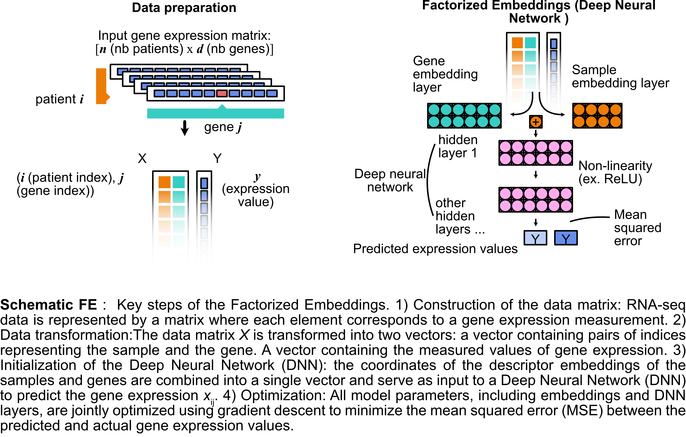

# Factorized Embeddings method
## Description
Factorized Embeddings is described in this [article](https://doi.org/10.1093/bioinformatics/btaa488) by Trofimov et al. 2020. This model is a self-supervised deep neural network that uses tensor factorization to simultaneously learn gene and sample representation spaces. This type of network is tailored to work with large RNA sequencing data, but can be applied to any type of large multivariate data. The FE model treats both factors (typically samples and gene) as factors contributing to characterizing the values (ie. gene expression data). This architecture generates sample representations that can be used for auxiliary tasks such as visualization or classification.

The code in this package is based on the first Factorized Embeddings analysis scripts according to the code provided by Trofimov et al. (2020) [GitHub link](https://github.com/TrofimovAssya/Factorizedembeddings). The demonstrated functionalities of Factorized Embeddings are implemented in the Julia programming language [julialang.org](www.julialang.org) using the Flux library [Innes 2018](https://fluxml.ai/Flux.jl/stable/).

The main features of the code include:

* Generation of low-dimensional sample embeddings that can be used for auxiliary tasks like 2D visualization or classification.
* Highly configurable models via a dictionary of hyperparameters provided by the user.
* During network optimization, models, learning curves, reconstruction performance, and, if possible, 2D sample embedding visualizations are recorded.
* Once trained, the model can infer new points.
* A functionality is also available for imputing the sample embedding space in 2D.

Model optimizations were tested using SGD with the ADAM optimizer (Kingma and Ba 2017) on GPUs (V100-SMX2, 32 GB) on servers with 64 GB RAM. It is important to note that this implementation requires access to a GPU for optimal performance. The code can be adapted for specific server constraints, such as reducing mini-batch sizes and limiting the number of network parameters. Details about the required package installations for GPU usage are also provided in this guide.




## Public Interface
### Main methods
```@docs
generate_params
```

```@docs
fit
```

```@docs
fit_transform
```

```@docs
infer
```

### Other utility methods

```@docs
fit!
```

```@docs
reset_embedding_layer
```
This function allows to initialise the sample embedding with a certain pre-defined embedding.

```@docs
train!
```

```@docs
FE_model
```

```@docs
prep_FE
```